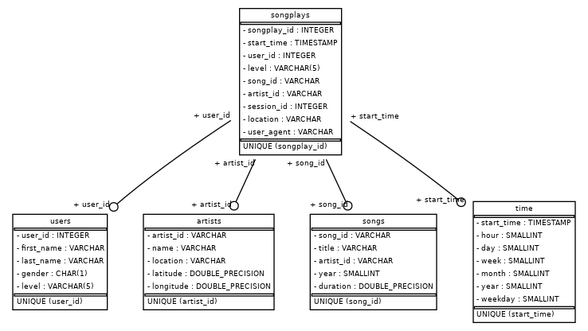

# Project: Data Warehouse

## Introduction
A music streaming startup, Sparkify, has grown their user base and song database and want to move their processes and data onto the cloud. Their data resides in S3, in a directory of JSON logs on user activity on the app, as well as a directory with JSON metadata on the songs in their app.

As their data engineer, you are tasked with building an ETL pipeline that extracts their data from S3, stages them in Redshift, and transforms data into a set of dimensional tables for their analytics team to continue finding insights in what songs their users are listening to. You'll be able to test your database and ETL pipeline by running queries given to you by the analytics team from Sparkify and compare your results with their expected results.

---

## Project Description

The startup sparkify want to analyze the behavior of their users on their music
streaming app, so they could understand what songs users are listening to. Therefore in this project, a star schema 
is chosen, because it is optimized for querying the user's behaviour.

In this Project an ETL Pipeline is implemented, which load the raw data (songs and logs) from S3 to the Staging 
in Redshift. From the staging, the star schema (fact and dimension) will be filled by using SQL Command.

The process of ETL is described in the following steps:
1. Read from the raw data (songs and logs) from S3 and load with `COPY` command to the staging table in Redshift.
2. Transform the data from the staging table to the star schema (fact and dimension) in Redshift.
---

## Project Structure

```
.
├── assets : static files
├── create_tables.py : script to create the tables
├── dwh.cfg.template : template file to genereate the config files
├── etl.py : script to execute the ETL pipeline
├── infra : terraform folder to deploy the infrastructure
├── README.md : project description
├── requirements.txt : list of all dependencies
├── sql_queries.py : define the queries to be executed
├── sync_secrets.py : script to sync the secrets from the AWS Secrets Manager to the local config files
└── VERSION.md : version of the cli-tool
```
---

## Project Datasets
There are the S3 links for each:

- Song data: `s3://udacity-dend/song_data`
- Log data: `s3://udacity-dend/log_data`

Log data json path: `s3://udacity-dend/log_json_path.json`

### Song Dataset

The first dataset is a subset of real data from the [Million Song Dataset](https://labrosa.ee.columbia.edu/millionsong/)
. Each file is in JSON format and contains metadata about a song and the artist of that song. The files are partitioned
by the first three letters of each song's track ID. For example, here are filepaths to two files in this dataset.

```
song_data/A/B/C/TRABCEI128F424C983.json
song_data/A/A/B/TRAABJL12903CDCF1A.json
```

And below is an example of what a single song file, TRAABJL12903CDCF1A.json, looks like.

```json
{
  "num_songs": 1,
  "artist_id": "ARJIE2Y1187B994AB7",
  "artist_latitude": null,
  "artist_longitude": null,
  "artist_location": "",
  "artist_name": "Line Renaud",
  "song_id": "SOUPIRU12A6D4FA1E1",
  "title": "Der Kleine Dompfaff",
  "duration": 152.92036,
  "year": 0
}
```


### Log Dataset

The second dataset consists of log files in JSON format generated by
this [event simulator](https://github.com/Interana/eventsim) based on the songs in the dataset above. These simulate app
activity logs from an imaginary music streaming app based on configuration settings.

The log files in the dataset are partitioned by year and month. For example, here are filepaths
to two files in this dataset.

``
log_data/2018/11/2018-11-12-events.json log_data/2018/11/2018-11-13-events.json
``

**Example**

```json
{
  "artist": "Muse",
  "auth": "Logged In",
  "firstName": "Harper",
  "gender": "M",
  "itemInSession": 1,
  "lastName": "Barrett",
  "length": 209.50159,
  "level": "paid",
  "location": "New York-Newark-Jersey City, NY-NJ-PA",
  "method": "PUT",
  "page": "NextSong",
  "registration": 1540685364796,
  "sessionId": 275,
  "song": "Supermassive Black Hole (Twilight Soundtrack Version)",
  "status": 200,
  "ts": 1541721977796,
  "userAgent": "\"Mozilla/5.0 (Windows NT 6.3; WOW64) AppleWebKit/537.36 (KHTML, like Gecko) Chrome/36.0.1985.143 Safari/537.36\"",
  "userId": "42"
}
```
---

## Star Schema (Data Catalog)
The star schema is chosen because it is optimized for querying the user's behaviour.

The goal to be achieved with the star schema is to optimize queries on song play analysis.

Following is the ERD of the star schema:

### Fact Table

#### songplays table

This tables contains the song play events in the log data.

| Column Name | Type       | Example                            |
|-------------|------------|------------------------------------|
| songplay_id | IDENTITY   | 1210                               |
| start_time  | TIMESTAMP  | 2018-11-21 21:56:47.796000         |
| user_id     | INT        | 15                                 |
| level       | VARCHAR(5) | paid                               |
| song_id     | VARCHAR    | SOZCTXZ12AB0182364                 |
| artist_id   | VARCHAR    | AR5KOSW1187FB35FF4                 |
| session_id  | INT        | 818                                |
| location    | VARCHAR    | Chicago-Naperville-Elgin, IL-IN-WI |
| user_agent  | VARCHAR    | "Mozilla/5.0 (X11; .."             |

---

### Dimension Table

#### songs table

This table contains the songs from the music dataset.

| Column Name | Type     | Example              |
|-------------|----------|----------------------|
| song_id     | VARCHAR  | SOGVQGJ12AB017F169   |
| title       | VARCHAR  | Ten Tonne            |
| artist_id   | VARCHAR  | AR62SOJ1187FB47BB5   |
| year        | SMALLINT | 2005                 |
| duration    | FLOAT    | 337.68444            |

---

#### artist table

This tables contains the artist from music dataset.

| Column Name | Type    | Example                 |
|-------------|---------|-------------------------|
| artist_id   | VARCHAR | AR0IAWL1187B9A96D0      |
| name        | VARCHAR | Danilo Perez            |
| location    | VARCHAR | Panama                  |
| latitude    | FLOAT   | 8.4177                  |
| longitude   | FLOAT   | -80.11278               |

---

#### time table

This tables contains timestamps of records in **songplays** broken down into specific units.

| Column Name | Type      | Example                    |
|-------------|-----------|----------------------------|
| start_time  | TIMESTAMP | 2018-11-17 00:02:24.796000 |
| hour        | SMALLINT  | 0                          |
| day         | SMALLINT  | 17                         |
| week        | SMALLINT  | 46                         |
| month       | SMALLINT  | 11                         |
| year        | SMALLINT  | 2018                       |
| weekday     | SMALLINT  | 5                          |

---

## Infrastructure

For this project, I'll be using Amazon Web Services (AWS) to store data and run ETL pipelines. You'll be using the following services:
- IAMRole
- Redshift
- S3

Make sure that aws profile in `~/.aws/credentials` is set to `udacity`.

To generate the infrastructure, I'll be using the [Terraform](https://www.terraform.io/) tool.
```bash
cd infra/
terrafrom apply
```

## Running the application
1. Fill out the `dwh.cfg` file with your AWS credentials. It could be done in 2 ways:
   1. By creating infrastructure yourself and sync secrets to your local machine.
      - Make sure `~/.aws/credentials` is set to `udacity`, otherwise change the variable `AWS_PROFILE` in `sync_secret.py`
      - Run sync_secret.py to sync the AWS secrets to the `dwh.cfg` file. (It will generate automatically if it doesn't exist from the template file)
   2. By filling out manually.

2. Run `python create_tables.py` to create the tables in Redshift.
3. Run `python etl.py` to load data from S3 to Redshift.